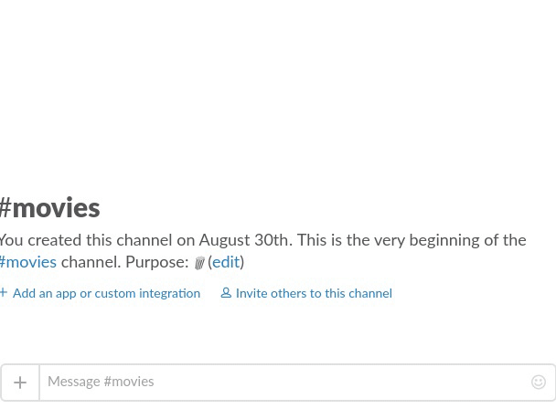

# Couchpotato Slackbot
[](https://github.com/sindresorhus/xo)

> Add movies to your couchpotato wanted list with just a simple slack message!



## Features
At the moment Mr. Potato has these features.
- Search for movies
- Add a movie by title ('download movie Frozen')
- Add a movie by IMDB id ('download movie tt2788732')

## Run
To start the bot simply run the start script inside the bin directory:
```
$ ./bin/start
```
Or `npm install` and `npm start` to launch the bot!

### Docker
There is a dockerfile to build a docker image.
Run the following inside the project directory to build the image:
```
$ docker build -t couchbot .
```
And launch it with the following command:
```
$ docker run -d --name couch-slackbot couchbot
```

## Configuration
Configuration of your bot can either be done using a config file or pass environment variables.

### File
In the `config` folder there is a `config.json.example` file you can copy and rename to `config.json`. Once configured you are ready to start the bot.

### Environment variables
If a config file is not ideal for your setup use environment variables. You can see in the table which env var to use for each config value.

| Description | ENV | Required |
|-------------|-----|----------|
| The slack token for this slackbot | CB_SLACK_KEY | ✓ |
| The name of the slackbot | CB_SLACK_NAME | ✓ |
| Couchpotato server hostname/ip | CB_HOST | ✓ |
| Couchpotato server port | CB_PORT | ✓ |
| Couchpotato API key | CB_COUCH_KEY | ✓ |

## Usage
Mr. potato is listening to the following commands / messages. It can depend per command where its available. Most of them work in a channel but some only per direct message.

### Search
**Available in:** Channel & Direct message.

To search for a movie send the following as a private message: `search movie harry potter` This will return a list with the movies it found. _(Example gif on top of the README)._ The list returned also shows the IMDB id. This identifier can be send with the download movie command.

### Download
**Available in:** Channel & Direct message.

To add a movie to the wanted list its either possible to send `download movie Bad Boys II` it will add the first search result. _When using a movie title with the download command try to be as specific as possible._ Or send the IMDB identifier `download movie tt0172156`.

### help
**Available in:** Direct message.

If you cannot access this readme for documentation and needs some help with some commands. Ask Mr. Potato for some help by sending `help` in a direct message. It will respond with the available commands.

### Admin commands
Admin commands are send in a private message to the bot, but the bot will only react on it if a admin user has send the message.

#### Version
By sending `!version` it will answer with the current version of the bot your talking to and the version of couchpotato which is configured.

### License
[MIT](https://opensource.org/licenses/MIT)
